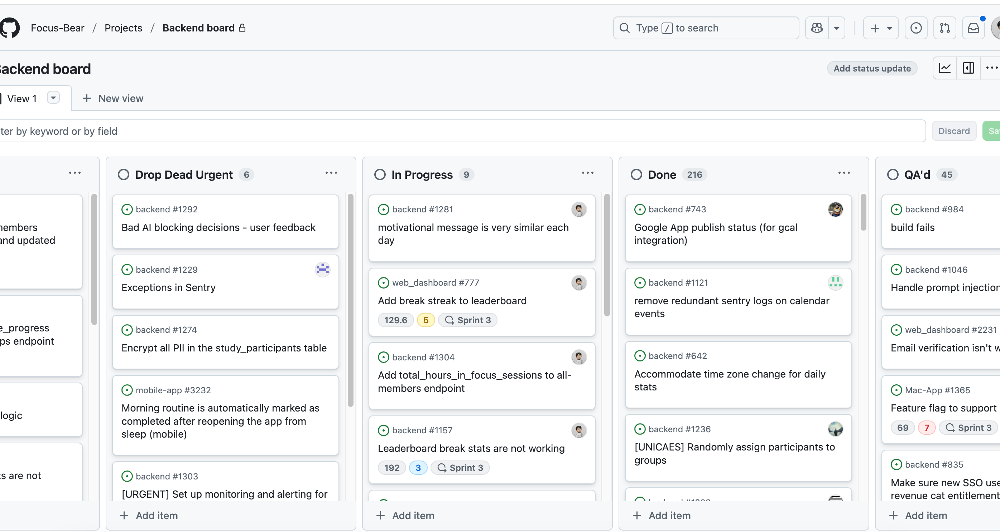

## Kanban workflow

### How does Kanban help manage priorities and avoid overload?
Clear progress like which task to work on (can assign tasks and tag users), limit WIP to avoid overload. Clear priorities by dividing the tasks into different stages.
Making sure the priorities are clear by listing down the tasks with due dates.
Can focus on the task that I should be working on by limiting Work In Progress.

### How can you improve your workflow using Kanban principles?
Besides the items I mentioned in the previous answer, I can improve my workflow by:
- Reviewing and updating the board regularly to reflect actual progress, not just planned work.
- Using Kanban to identify bottlenecks or tasks that are stuck and adjust my focus accordingly.
-	Breaking tasks into **smaller, actionable items** to reduce ambiguity and make progress easier to track.
-	Using the board as a reflection tool during retrospectives to understand where I can optimise how I work or how I plan tasks.

I have not yet seen Focus Bear Team's Kanban board, but here is my Kanban board that I made based on what I researched, as you can see, I have moved my Agile Workflows & Kanban (issue 5) from "in-review" to "In progress" as FocusBearQA made some comment and feedback for my markdown file for this issue. Once the markdown file is edited, I will move it to "in-review" board again so that I can easily see what issues should I work on next in the "in-progress" column. Once FocusBearQA approves my markdown files for issues, I will then move the issues to the "Done" column. 

Screenshot of the Kanban board

Screenshot of the status of the issue (Agile Workflows & Kanban #5)

This is a screenshot of the Backend Kanban board, as you can see, I have been assigned issues to work on.

