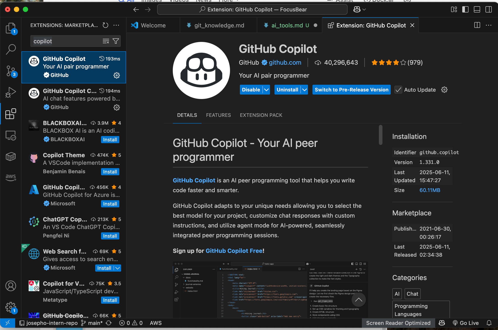

# AI Tools

## Which AI tools did you try?
I have used ChatGPT since late 2022 / early 2023 because I took a Natural Language Processing course through ANU (my university). Since then, I have been trying out other AI models like Gemini, Grok, Deepseek (haven't tried Perlexity, Claude and other models) as well as GitHub Copilot and Replit. I have already installed and tried out GitHub Copilot on VS Code. I am keen to use it and gain hands-on experience on how to utilise the AI tools I currently have.

I have used ChatGPT in various occasions, e.g. debugging for my university assignments, leetcode practices when I get lost, simple tasks like writing emails or formatting documents (like I used ChatGPT to help me draft my markdown reflection for some of the onboarding tasks), interview preperation and counselling (not professional but it is helpful).

## What worked well? What didn’t?

I am keen to utilise Copilot in my internship, and I am aware that, using AI for coding, it is important to understand the programming language, its syntax and the algorithms before using AI to facilitate. In the case when I use ChatGPT for coding, I realise that the solutions provided by ChatGPT (espcailly for leetcode questions or assginments) are usually not the most efficient (long runtime or required more memory). It also provides incorrect codes or codes that cannot be compiled.

On the other hand, I noticed that AI tools like ChatGPT can be useful if I already have an algorithm (for what I would like to code) in mind, it could help with clarifying the structure of the algorithms or the steps to take to achieve a solution. It could also point out the logic flaws sometimes. I think GitHub Copilot can be so powerful when you try to write out the algorithm it can help you complete the lines. It definitely saves a lot of time to complete the code.

One best practice I will follow when using AI at Focus Bear is: I will always review, test, and validate AI-generated code before committing, and avoid inputting any sensitive or proprietary data into AI tools

## When do you think AI is most useful for coding?

AI is most useful for coding when I already have a clear understanding of the problem and algorithm, and need help with:
- Generating repetitive code patterns
- Autocompleting functions or method structuring / skeleton (e.g. with GitHub Copilot)
- Writing documentation, comments, or formatting code
- Providing suggestions for unit tests or validation functions
- Offering alternative solutions or approaches when I'm stuck

I understand that still need to review, test, and fully understand the AI-generated code before using it. As it can sometimes suggest inefficient, incorrect solutions.