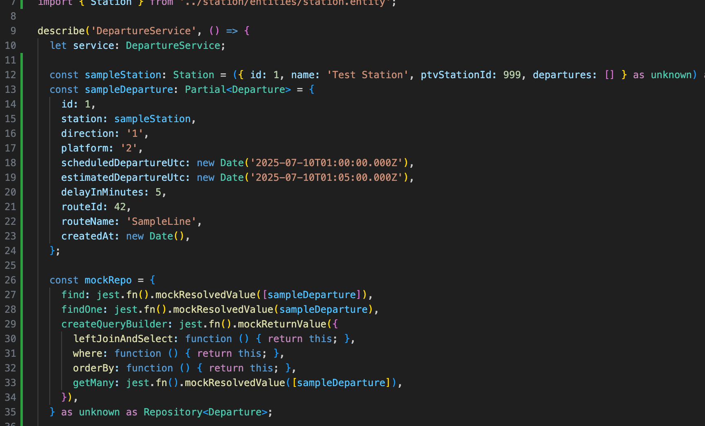
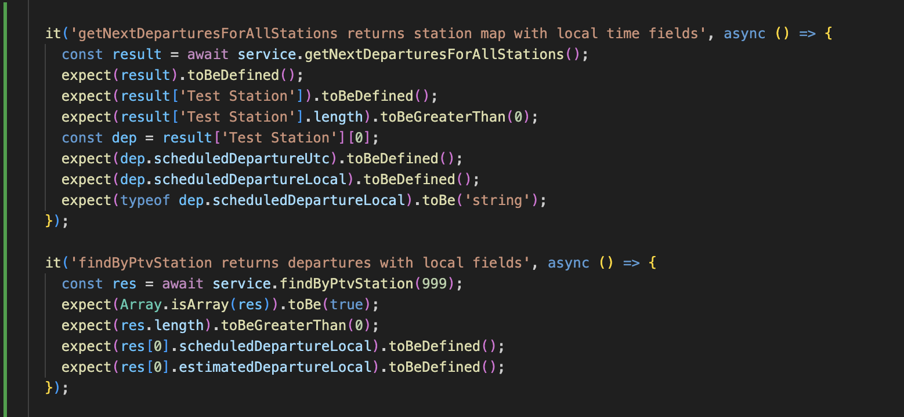
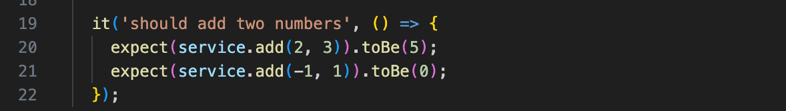
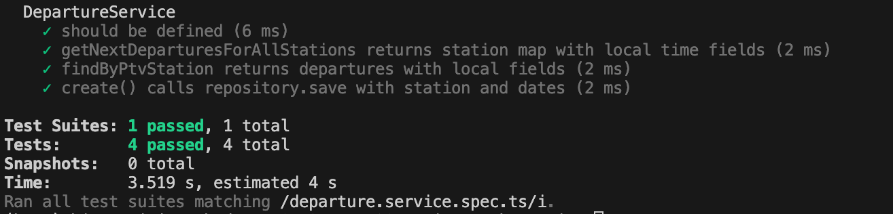

# Introduction to Unit Testing with Jest

## ✅ Tasks

### Research what Jest is and why unit tests are important.
In one sentence, Jest is a JavaScript testing framework used to ensure code correctness through unit tests. It is widely used because it is quick, easy to set up, and provides a rich API for testing various aspects of JavaScript applications.

| Test type | Definition | Scope | Isolation | Speed | Typical tools | When to use |
|---|---|---:|---|---:|---|---|
| Unit test | Tests a single function/class in isolation | One module/class/method | High (mocks/stubs for dependencies) | Fast (milliseconds) | Jest, Mocha, Jasmine | Validate logic, edge cases; run on every commit |
| Integration test | Tests interaction between multiple modules or components (e.g., repo + DB adapter) | Several modules or a subsystem | Medium (real or in-memory dependencies) | Moderate (seconds) | Jest, Supertest, testing-library, real DB or test DB | Verify modules work together, DB queries, serializers |
| End-to-end (E2E) test | Tests the whole application from entry point to persistence, simulating real user flows | Full system (API/UI + DB + external services) | Low (uses real services or full stack) | Slow (seconds → minutes) | Cypress, Playwright (UI); Supertest/Jest for API e2e | Validate complete user journeys and deployment readiness |

Notes:
- Use a fast unit-test suite for quick feedback and CI; run integration/e2e less frequently (e.g., nightly or pre-release).
- Balance test pyramid: many unit tests, fewer integration tests, minimal e2e tests.
**Key Features:**
- **Test Runner**: Jest includes a test runner that automatically discovers and executes your tests.
- **Assertion Library**: It provides a built-in set of functions (matchers) for verifying the expected behavior of your code.
- **Mocking**: Jest has powerful mocking capabilities, allowing you to isolate and test specific parts of your code without relying on external dependencies.
- **Speed and Performance**: Jest is known for its speed, especially when running tests in parallel.
- **Snapshot Testing**: Jest allows you to capture snapshots of your component's output and compare them against previous versions.
- **Configuration**: Jest is designed for minimal configuration, allowing you to get started quickly.

### Set up Jest in your React project (if not already included).
Well I don't have a react project as I am working on the backend. But I created some jest in the personal project that I have been working on (with the help of ChatGPT). 

Here is the screenshot:

*the screenshot above is the mock setup of the ptv_departure project*

*the screenshot above shows how to use the "it" function in Jest to define a test case*

In addition, I also created the MathService class and its corresponding test file.
Here is the test requested by the issue. 

### Run the test and check that it passes.

As you can see in the screenshot, the test for the utility function passed successfully.

## ✅ Reflection (in unit_tests.md):
### Why is automated testing important in software development?
With one command (or only a few commands), developers can make sure the logics are correct within the whole repository. And can make sure there is no logical errors introduced in the codebase. It also:
- Detecting regressions early (prevents re-breaking features)
- Enabling safe refactoring and cleaner design
- Serving as documentation for expected behavior
- Supporting CI/CD and faster release cycles
- Test coverage and avoiding flaky tests

### What did you find challenging when writing your first Jest test?
I find setting up the test is quite challenging, especially when it comes to mocking dependencies, navigating where to add the test and ensuring the test environment is correctly configured. Other than that, writing the test itself, especially a simple one, is not too difficult.

